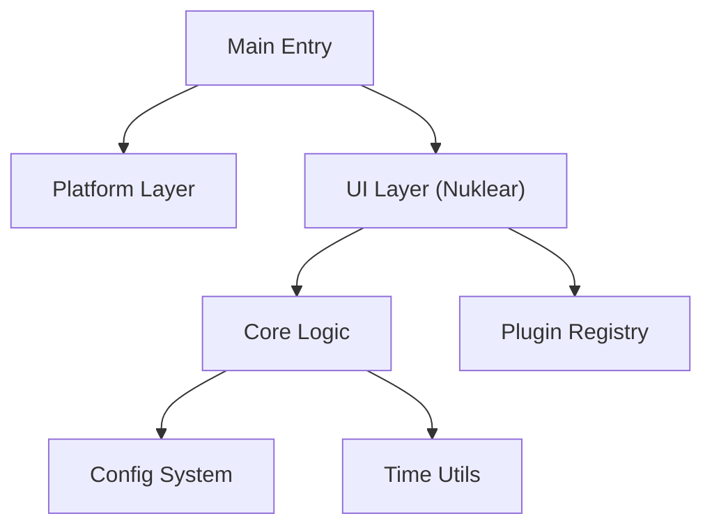

# Digital Clock - Final Update

This project represents the culmination of a journey from a simple terminal-based C application to a modern, modular, cross-platform GUI utility. This release ("Retirement Edition") introduces a completely refactored architecture using the **Nuklear** immediate-mode UI library, demonstrating how C can be both lightweight and expressive.

## The Journey

1.  **Terminal Beginnings**: Started as a class assignment `index.c` focusing on pure logic and ANSI escape codes.
2.  **Native GUI**: Expanded into `digital_clock_win32.c` and `digital_clock_gtk.c` to explore raw OS APIs.
3.  **Modular Refactor (Final)**: Re-engineered into a layered architecture (Core, Platform, UI) to support plugins and a unified UI across Linux and Windows without code duplication.

## Architecture

The application is now structured into distinct layers:



- **Core**: Handles time verification, configuration parsing (via `inih`), and business logic.
- **Platform**: Abstracts OS-specifics like sleep efficiency and file paths.
- **UI**: Renders the interface using **Nuklear**, providing a consistent look on X11 (Linux) and Win32 (Windows).
- **Plugins**: A flexible system allowing extensions (e.g., Stopwatch) to hook into the application loop.

## Features

- **Modern UI**: Clean, vector-based interface that scales with your window and now includes a large dedicated clock font with an italic footer accent.
- **Power Efficient**: Adaptive refresh (≈30 Hz) keeps the UI responsive without pinning the CPU; sleeps align with the next frame/second.
- **Plugins**: Built-in Stopwatch plugin demonstrates the registry; drop-in modules can hook into update/draw without touching the core loop.
- **Configurable**: Persists settings (12/24h, date visibility, future themes) to `~/.digitalclockc.conf` on Linux or `%USERPROFILE%\.digitalclockc.conf` on Windows.
- **Terminal Easter Egg**: Launching from a TTY prints a dragon ASCII banner with a “Thank you for supporting open source” note before the GUI attaches.
- **Lightweight**: Minimal dependencies (standard C libs + X11 on Linux or Win32/GDI on Windows). Everything else lives in `vendor/` and compiles as part of the tree.

## Building

### Linux

Requirements: `gcc`, `make`, `libX11-dev` (or equivalent).

```bash
make
./digitalclock
```

### Windows (MSYS2 / MinGW-w64)

Install [MSYS2](https://www.msys2.org/), open an **MSYS2 MinGW x64** shell, then:

```bash
pacman -S --needed base-devel mingw-w64-x86_64-toolchain
make clean && make
./digitalclock.exe
```

Cross-compiling from Linux works as well (`x86_64-w64-mingw32-gcc`), but MSYS2 provides the smoothest path.

## Controls

- **Settings Tab**: Toggle time format and date display, save config.
- **Stopwatch Tab**: Start, Stop, and Reset the specialized stopwatch plugin.
- **Close**: Close the window to exit.

---

_Archived 2025. Thanks for the time._
